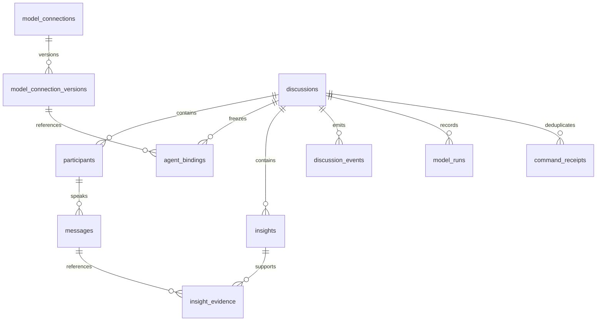

# 数据模型

```mermaid
erDiagram
  model_connections ||--o{ model_connection_versions : versions
  discussions ||--o{ participants : contains
  discussions ||--o{ agent_bindings : freezes
  model_connection_versions ||--o{ agent_bindings : references
  participants ||--o{ messages : speaks
  discussions ||--o{ insights : contains
  insights ||--o{ insight_evidence : supports
  messages ||--o{ insight_evidence : references
  discussions ||--o{ discussion_events : emits
  discussions ||--o{ model_runs : records
  discussions ||--o{ command_receipts : deduplicates
```

每个讨论内 message_seq、turn_id、event_seq 唯一。角色、回应目标和洞察证据的归属在事务内校验。SQLite 开启 WAL、foreign_keys 与 busy_timeout。密钥 AES-256-GCM 加密；主密钥和数据库存入被 Git 忽略的 .data。公开连接类型只返回 hasApiKey，不返回密文。
